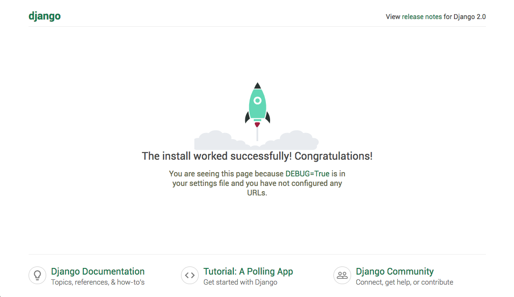

# Get-Started-Flask

## 写在前面
介绍了使用Django和Flask建立微服务的方法

# 第一章 使用Flask搭建Rest API
## Flask简介
[Flask](http://flask.pocoo.org/docs/0.12/)在官网中介绍自己是一个微框架(microframework)，意指Flask力图实现的是核心的简洁和可扩展性（Flask aims to keep the core simple but extensible）。Flask相较于Django等框架而言，在内核中并不直接提供诸如数据库抽象等模块，取而代之的是交给用户来选择自己的实现方式，既可以完全从头实现，也可以采用加载第三方的Flask插件的方式去实现。

从软件开发哲学角度来说，用Flask实现一个项目就像是一个做加法的过程，一开始开发者面对的只有核心的骨架，需要什么功能就寻找合适的插件或实现来一点点加上去，直到满足项目需求。而Django则在一开始就提供了各种各样的功能模块，对于不熟悉Django架构的用户而言，这些功能会使得学习曲线变得更加陡峭，新用户往往迷失在大量的文档中，从开发测试的角度而言，复杂的架构可能带来负面影响，如性能较低，Debug难度大（可能出错误的点多）等问题。与之相反，Flask这类轻量级框架如果用来做非常复杂的功能开发，则会需要投入很多精力去整合各种模块，可能不如直接使用django来的更加方便。

## Flask vs Django
两个框架都能够实现最基本的API微服务，对于二者的选择主要看开发者对于架构的偏好性，是喜欢自己造轮子，还是喜欢花时间学习框架的使用方法：
作者建议在如下情况下可以优先考虑使用Django：

* 希望跟SQL数据库进行比较好的交互时（ORM）
* 希望能够一站式的解决，诸如模板、Session、Authentication等等功能时


## 案例说明
为了简要说明问题，下面例子将会演示将中文分词功能制作成RestAPI变成web服务的全部过程；

## 依赖环境
需要Python-3.6环境 (推荐安装[Anaconda](https://anaconda.org/))

```bash
pip install jieba #(0.39)
pip install flask
pip install Flask-JSON
```

## 创建hello.py
```python
#hello.py
from flask import Flask #导入Flask库
from flask import request #导入处理request的库
from flask_json import FlaskJSON, JsonError, as_json #导入处理Json输入输出的库
import jieba #导入分词器模块

app = Flask(__name__) #初始化app
json = FlaskJSON(app) #初始化json处理器

token = lambda x:list(jieba.cut(x)) #定义分词器处理函数

@app.route('/api/token', methods=['POST']) #装饰器，用来设定URL路径和接受的方法
@as_json #装饰器，用来将函数的return封装成json格式返回
def test(): #处理访问的函数
    data = request.get_json(force=False, silent=False, cache=True) #从request里面读取json数据
    try: #处理异常
        response = token(data['text']) #从json数据里面读取text字段，生成返回
    except (KeyError, TypeError, ValueError): #捕获数据类型异常
        raise JsonError(description='Invalid value.') #将异常反馈会调用
    return response #正常返回，这个response的内容会被转成json格式

```
备注：关于Flask-JSON的用法可以参考[链接](http://flask-json.readthedocs.io/en/latest/)

## 运行Flask server
```bash
$ export FLASK_APP=hello.py #指定要运行的flask app
$ flask run #运行服务
 * Running on http://127.0.0.1:5000/ #服务正常启动，等待连接

```

## 测试我们定义好的API
```bash
curl -i -H "Content-type: application/json" -X POST http://127.0.0.1:5000/api/token -d '
    {
        "text":"今天上海真的好冷啊！我也觉得啊！"
    }'

```
如果服务正常工作会得到如下返回：

```bash
HTTP/1.0 200 OK
Content-Type: application/json
Content-Length: 182
Server: Werkzeug/0.14.1 Python/3.6.3
Date: Tue, 27 Mar 2018 15:07:11 GMT

[
  "\u4eca\u5929",
  "\u4e0a\u6d77",
  "\u771f\u7684",
  "\u597d",
  "\u51b7",
  "\u554a",
  "\uff01",
  "\u6211",
  "\u4e5f",
  "\u89c9\u5f97",
  "\u554a",
  "\uff01"
]

```
如果传入的数据异常会得到如下返回：
```bash
{
  "description": "Invalid value.",
  "status": 400
}
```

## 补充说明
Flask可能出现的问题：

1. RuntimeError: Click will abort further execution because Python 3 was configured to use ASCII as encoding for the environment.

    **解决方法：**

    ```bash
    export LC_ALL=zh_CN.UTF-8
    export LANG=zh_CN.UTF-8
    ```

2. python socket 10054错误。原因是当页面请求比较大的数据 or 需要一定量计算时间的数据， 这个时候， 未等到服务端返回数据， 用户关闭页面（close socket client），会导致10054异常，这个异常会直接导致python进程异常退出。[问题链接:](https://www.zhihu.com/question/41564604/answer/123362299)

    **解决方案是**[用ngix和uwsgi配合flask](https://www.digitalocean.com/community/tutorials/how-to-serve-flask-applications-with-uwsgi-and-nginx-on-ubuntu-14-04)


# 第二章 使用Django搭建Rest API
## Django简介
[Django](https://www.djangoproject.com/)是一个很强大的web框架，它帮我们解决了接受HTTP请求，发送HTTP响应等等苦力活，让我们可以避免写这些底层的代码；我们只负责在更高层次考虑如何响应请求就可以了；

Django的官方基础教程了包含了一下7部分：

* Requests and response
* Models and the admin site
* Views and templates
* Forms and generic views
* Testing
* Static files
* Customizing the admin site

我们完成打包服务只需要 **'Requests and response'** 和 **'Views'** 部分就可以了，所以下面的内容也只会涉及这部分内容。


## 依赖环境
需要Python-3.6环境 (推荐安装[Anaconda](https://anaconda.org/))

```bash
pip install jieba  #(0.39)
pip install Django #(2.0.3)
pip install djangorestframework
```

## 开始第一个project
django框架在开始一个项目之前已经为我们预设好了许多参数和配置，因此开始project第一步是要初始化这些参数；使用 *django-admin* 来实现这一步：

```bash
# 这里 ‘cn_tokenizer’ 是你的项目名称
django-admin startproject cn_tokenizer
```

下面是成功执行后得到的文件夹以及文件夹目录文件详情；

```bash
cn_tokenizer/
├── cn_tokenizer
│   ├── __init__.py
│   ├── settings.py
│   ├── urls.py
│   └── wsgi.py
└── manage.py
```

进入 cn_tokenizer 目录之后除了项目目录之外只有一个 manage.py 文件，你可以运行下面的命令，查看 Django 是否正常安装；

```bash
python manage.py runserver
```

启动服务后，屏幕端会提示你 `Starting development server at http://127.0.0.1:8000/`，说明服务已经正常启动了. 此时可以通过浏览器打开http://127.0.0.1:8000/页面:



但是此时project还只是一个空架子，我们需要添加具体 app 服务；


## 创建第一个APP
django框架也为搭建app(web服务)预设了很多参数和配置，我们需要调用manage.py来实现：

```bash
# 这里 'app' 是设置的app(服务)名称
python manage.py startapp app
```
此时 ‘cn_tokenizer’ 文件夹的文件结构如下：

```bash
cn_tokenizer/
├── app
│   ├── __init__.py
│   ├── admin.py
│   ├── apps.py
│   ├── migrations
│   │   └── __init__.py
│   ├── models.py
│   ├── tests.py
│   └── views.py
├── cn_tokenizer
│   ├── __init__.py
│   ├── __pycache__
│   │   ├── __init__.cpython-36.pyc
│   │   ├── settings.cpython-36.pyc
│   │   ├── urls.cpython-36.pyc
│   │   └── wsgi.cpython-36.pyc
│   ├── settings.py
│   ├── urls.py
│   └── wsgi.py
├── db.sqlite3
└── manage.py
```

可以发现在 project 主目录下又增加一个 api 文件夹；在[官网](https://docs.djangoproject.com/en/2.0/intro/)中每一个文件的用处都有详细的介绍；

## Views:定义处理requests和返回response的函数

在app目录中中涉及 requesets 和 response 部分的只有 views.py文件；因为 views.py 负责接收 requests 和返回 response 的功能，我们将会在 views.py 中 初始化 jieba 分词，并调用 jieba 分词处理 request 并将分词的结果返回：

```python
# views.py
from django.shortcuts import render
from rest_framework.parsers import JSONParser
from django.http import JsonResponse
from django.views.decorators.csrf import csrf_exempt
import jieba
# Create your views here.

# jieba分词词封装成lambda函数，用于对得到的数据进行处理
token = lambda x:list(jieba.cut(x))

# 取消当前函数防跨站请求伪造功能，即便setting中设置了全局中间件
@csrf_exempt
# 定义处理request 的函数
def tokenizer(request):
	# 提取request中请求方式判断
	if request.method == 'POST':
		# 解析request的数据
    	data = JSONParser().parse(request)
    	# 获取key 为text 的value
    	text = data.get('text')
    	# 调用前面初始化的分词函数来处理 requests
    	result = token(text)
    	# 返回（response）分词结果给用户
    	return JsonResponse(result, safe=False)
    else:
		return JsonResponse("Error!", safe=False)

```
上面便是实现 jieba 分词功能的 views.py文件内容；通过匿名函数token初始化中文分词功能，然后定义函数 tokenizer 来处理 requests 中请求方式为 POST 的request；

*另：之所以使用装饰其 `@csrf_exempt`，是因为django为用户实现[防止跨站请求伪造的功能](https://docs.djangoproject.com/en/2.0/ref/csrf/)，通过中间件 `django.middleware.csrf.CsrfViewMiddleware` 来完成。而对于 django 中设置防跨站请求伪造功能有分为全局和局部。通过在处理请求的函数 requests 前面添加 `@csrf_exempt` 来取消当前函数请求伪造功能；*

## 定义urls:为API设置访问URL和ROUTE
我们在打包好服务后为了和客户端（如：wechat）集成，会提供给一个API的URL地址（例如http://localhost:8000/app/tokenizer/），想想我们定义好了处理好的函数，总要告诉别人该怎么去访问这个功能吧。

设置URL时我个人偏好讲每一个app服务独立分配的单独的文件中去，这就需要设置route来将不同的请求进行路由；

### 首先，修改cn_tokenizer的目录内的urls.py，指定不同服务所对应的文件
**`cn_tokenizer`** 目录内的 urls.py 如下：

```python
# urls.py

from django.contrib import admin
from django.urls import path, include

urlpatterns = [
    path('admin/', admin.site.urls), #Django默认后台管理页面
    path('api/', include('app.urls')) #指定处理api访问的是app目录内的urls.py
]
```
在 `urlpatterns` 的列表参数中  `path('api/', include('app.urls'))` 是我们添加的参数，它的实际效果时在 route 中添加 /api 路径，类似如：[`localhost:8000/api/`](localhost:8000/api/) 此时还没有关联到具体的函数，因此还有 include('app.urls'), 看app.urls就知道是起到连接app目录内的urls.py 文件的作用啦；

### 接下来，需要在app目录中新建一个urls.py文件;
**`app`** 目录内的 urls.py 如下：

```python
#!/usr/bin/env python

from django.urls import path
from . import views

urlpatterns = [
        path('tokenizer/',views.tokenizer)
        ]
```
在 `urlpatterns` 的参数 path('tokenizer/', views.tokenizer ) 则是将对 url [`localhost:8000/api/tokenizer/`](localhost:8000/api/tokenizer/) 的请求交给 views.py 中的 tokenizer 函数来处理；

## 注册app
在完成上述所有的操作之后就只差，现在只需要在 `setting.py` 文件 中注册一下 app 就可以了；setting 文件修改部分如下：

```python
# Application definition

INSTALLED_APPS = [
    'app', # 注册 app 名字与前面新建的 app 的名称要相同, 下面6个为系统内置服务
    'django.contrib.admin',
    'django.contrib.auth',
    'django.contrib.contenttypes',
    'django.contrib.sessions',
    'django.contrib.messages',
    'django.contrib.staticfiles',
]

```
## 启动服务
最后一步，启动服务：

```bash
# 默认 port 是 8000，如果需要更改 port 可以直接在下面的 command 后面直接添加你想更改的端口号
python manage.py runserver
```

## 访问服务
访问服务的方式有很多种，这里介绍两种：
第一种 直接通过 curl 命令访问：

```bash
curl -i -H "Content-type: application/json" -b cookies.txt -X POST http://localhost:8000/api/tokenizer/ -d '
    {
        "text":"今天上海真的好冷啊！我也觉得啊！"
    }'

#得到的返回如下
HTTP/1.1 200 OK
Date: Mon, 26 Mar 2018 07:44:05 GMT
Server: WSGIServer/0.2 CPython/3.6.3
Content-Type: application/json
X-Frame-Options: SAMEORIGIN
Content-Length: 144

["\u4eca\u5929", "\u4e0a\u6d77", "\u771f\u7684", "\u597d", "\u51b7", "\u554a", "\uff01", "\u6211", "\u4e5f", "\u89c9\u5f97", "\u554a", "\uff01"]%
```

## 小结
熟悉了Web框架，我们在编写Web应用时，注意力就从WSGI处理函数转移到URL+对应的处理函数，这样，编写Web App就简单了。更多的功能还是需要个人去读官网文档，毕竟那里才是最权威；

